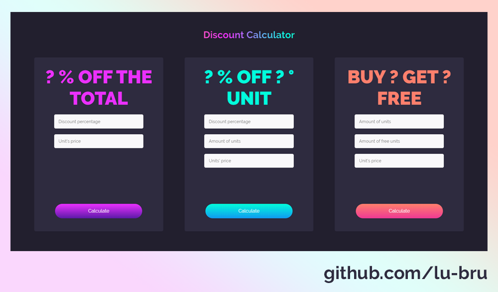

# discount-calculator
A Javacript calculator to quickly know how much you'd save during sales that you typically encounter in shopping malls and supermarkets.

## Calculators

- ? % Off the total price. A discount is applied to a unit's price. Example: 10% off.

- ? % off ? ° unit. You get a certain discount if you purchase more than one unit. (The amount of units needs to be bigger than 1). Example: 50% off the 2° unit

- Buy ? get ? free. You get a certain amount of free units if you purchase more than one. (The amount of free units needs to be lower than the total amount of units). Example: Buy 3 get 1 free.

## Design preview

